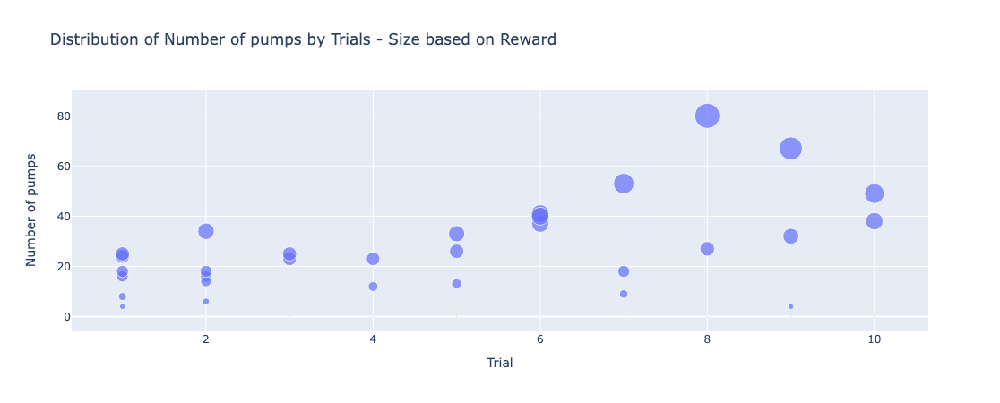
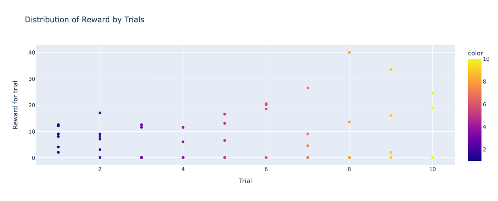
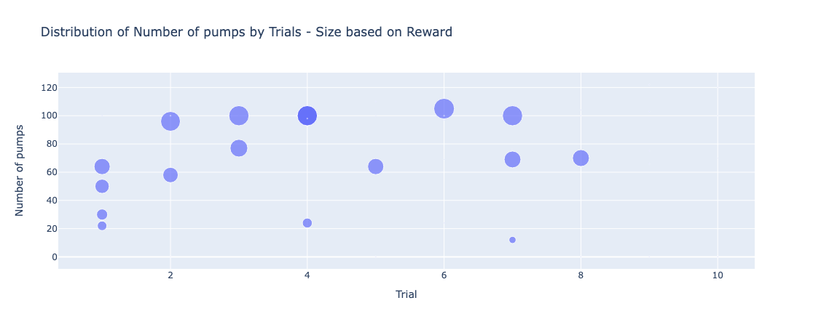
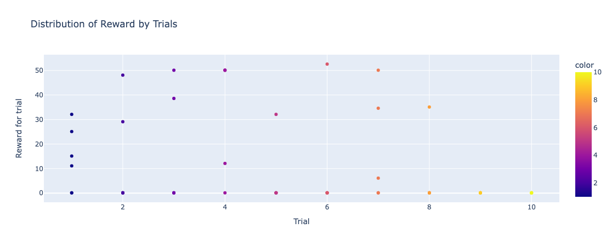

# Balloon Analogue Risk Tasj
Implementation of Balloon Analogue Risk Task (BART) using Django

### TODO
- [x] Setup Django environment
- [x] Implement standard BART and modified BART
- [x] Generate plotly visualizations
- [x] Style 
- [x] Deploy (CICD): https://www.bart.bynaol.com

## About
Balloon Analogue Risk Task (BART) is a computer game to measure risk taking behavior of players. It is used by researchers and employers to determine, among others, risk propensity. This repository of my implemetation of Balloon Analogue Rist Task (BART) using Djago. This implementaion provides collection of data in multiple ways. Collection for basic data points is already build in, however, the program is built to support implementaiton of recording for more data types. Currently live <a href="https://www.bart.bynaol.com/">on my website</a>. Read more <a href="https://www.bart.bynaol.com/about-bart">on the website's about page and more</a>

<strong>This file is updated as more of the internet is discovererd by the program. </strong>

## Possible Points of Upgrade
This you can find with in the codes as comments. These are points of upgrade I imagined could better the program. These are suggestions, and also my focus as I improve this program.

## Visualization
Visualizations for this project are made in Plotly because of the heasy imbedding and interactivity offered by Plotly.

See the interactive visualizations <a href="https://www.bart.bynaol.com/">on my website</a>.

The non-interactive versionis given here for fast access

## Current/Future Progress
Currently, under this project, I am working on:
- creating methods to record more type of data including time to decesion and mouse movement